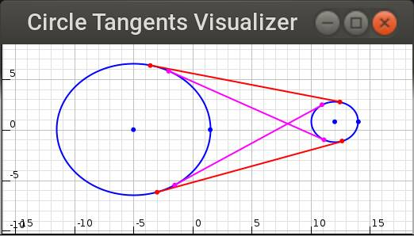

# CircleTangents

Routine for calculating tangent segments between two given circles and a java swing-based vizualizer (should be repurposable for other things).

Running vizualizer:

```sh
$ java -jar CircleTangentsViz.jar
```

## Screenshot


